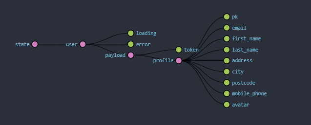

# A Django & React Template
<!-- ALL-CONTRIBUTORS-BADGE:START - Do not remove or modify this section -->
[](#contributors-)
<!-- ALL-CONTRIBUTORS-BADGE:END -->
A Django and React Template that will help you skip a lot of boilerplate and initial project setup, which features:
- [Passwordless](https://auth0.com/docs/connections/passwordless) user authentification/registration, which is a more modern and secure way of logging in, used by [Medium](https://medium.com/), [Microsoft](https://www.youtube.com/watch?v=8Na793pxKpk) and plenty more.
- Functionality to update the user profile.
- Responsiveness

This template is based on the [Ant Design](https://ant.design) ui kit and is powered by the [Django REST](https://www.django-rest-framework.org/) Framework.


# Motivation
When starting a new project it can be incredibly time consuming to reach the milestone that will finally let you start implementing your ideas, and doing actual work.

The goal of this project is to be just that, a solid modern project template that you can easily pick up on and not worry too much about the boilerplate.

# DISCLAIMER
Please bear in mind that this is a development version, for production you would ideally have to change a lot of settings and it is recommended that you go through them yourself and check what needs to be changed to make it safe for production deployment.

# Installation
## Option 1
### > **Docker**
To install it with docker, you only need to run the following command:
```bash
# Make sure that you have Docker installed, use -d to hide logs
docker-compose up --build
```
You can access it through [localhost:3000](http://localhost:3000/) by default.
#### To Remove the containers use:
```bash
docker-compose down
```
## Option 2
### > **React**

```bash
cd react
# Install the node packages
npm install
# Start the App in Development Mode
npm start
```

### > **Django**
```bash
cd django
# Create the virtual environment
python -m venv env 
# You need to activate everytime you open a new terminal
./env/Scripts/activate
# Install the requirements
pip install -r requirements.txt 
python manage.py makemigrations
python manage.py migrate
# In case django complains about migrations at any point go with
python manage.py migrate --run-syncdb
# Run the server
python manage.py runserver
```

You can access it through [localhost:3000](http://localhost:3000/) by default.

# Documentation
## > **React**

## Introduction

This documentation will assume a fair knowledge of React as well as some of the tools that we are used, including:

- [Ant Design](https://ant.design) as the UI webkit.
- [React Hooks](https://reactjs.org/docs/hooks-intro.html)
- [React Redux](https://redux.js.org/basics/usage-with-react)


## Updating the Base URL
To change the Base URL all that you have to do is change it inside the file [axiosConfig.js](./react/src/axiosConfig.js).
```jsx
const instance = axios.create({
    baseURL: 'http://localhost:8000'
});
```

## Routes
The App.js component ([App.js](./react/src/App.js)) is being used as the main router and it is here that the main routes are defined. If you want to define other routes in your sub-components, you should not use `<Router>` again.

As an example of this you can take the [My Profile](./react/src/components/MyProfile/index.js) page, where a `Switch` component is used:
> `MyProfile`
```jsx
<Switch>
    <Route exact path={`${basicPATH}`} component={BasicSettings} />
    <Route exact path={`${securityPATH}`} component={SecuritySettings} />
</Switch>
```
As you may have noticed the path is not a literal string, this is so that it can accomodate for any future path changes, you can implement this with the following code:
```jsx
// ...
// inside the component
const getUrl = () => {
    // This function can be used to reliably get the current url with 1 slash at the end
    const inconsistentUrl = props.match.url;
    const lastUrlChar = inconsistentUrl[inconsistentUrl.length - 1];
    return ((lastUrlChar === '/') ? inconsistentUrl : (inconsistentUrl + '/'));
}

const url = getUrl();
//paths: 
const basicPATH = `${url}basic/`;
const securityPATH = `${url}security/`
// ...
```
> Note: Unfortunately the getUrl can not be made into a helper function, at least for now.

## Customization - Antd Theming

ANTD is using Less as the development language for styling. A set of less variables are defined for each design aspect that can be customized to your needs.
There are some major variables below, all less variables could be found in [Default Variables](https://github.com/ant-design/ant-design/blob/master/components/style/themes/default.less). 

Your custom changes should go in `react/config-overrides.js`.

For all of the potential customizations don't hesitate to check [their documentation](https://ant.design/docs/react/customize-theme) which covers them all.

## Layout Component
Layout Component ([Layout.js](./react/src/containers/Layout.js))

In this template the layout component is to be used to display the main content of the webpage.
## Navbar
- When logged out:
    > 
- When logged in:
    > 

To **add more links** you can just add more `Menu.Item` under `Menu` and make sure that the `Link` `to` is the same as the `Menu.Item` `key` without the `/` at the end, otherwise it won't show as selected, you can look at how this was done for the existing ones.
> Tip: make sure that the `Menu.Item` is not nested in any other component and that it goes right under `Menu`.

## Sessions
The session is managed by the [Redux](https://redux.js.org/basics/usage-with-react) store.

When the page is loaded, an action `actions.authCheckState()` is dispatched, from [App.js](./react/src/App.js), to the [store actions](./react/src/store/actions/user.js) which just checks for the existence of a token in localStorage and if there is no token in localStorage it logs the user out, otherwise it checks the token's validity and dispatches some other actions [check `authCheckState()`](./react/src/store/actions/user.js) to see the code.

When the user is not logged in the store looks the following:


When the user is logged in the store looks the following:



> Note: To visualize the above you need to get the [Redux DevTools Extension](https://github.com/zalmoxisus/redux-devtools-extension).

- user
    - loading - is a boolean that can used, for example, in the conditional rendering of elements, this is used in [Login](./react/src/components/Login.js) and [My Profile](./react/src/components/MyProfile/index.js).  
    - error - is a boolen, that can be used, for example, to set a given element to show that it errored out, such as an icon.
    - email - note that email is moved inside profile once the user has logged in. 

## Login / Register 
Login ([Login.js](./react/src/components/Login.js)) / Register ([App.js](./react/src/App.js))

Both of these do exactly the same thing, they sign in the user whether they are registered or not, the reason why a registration page exists is to not confuse users that may be looking for the common register/login pages.
## My Profile
My Profile ([MyProfile/index.js](./react/src/components/MyProfile/index.js))

More options will be added in the future, these existing ones are just a proof of concept or example.
## Notifications
Notifications ([notificationHelpers.js](./react/src/Helpers/notificationHelpers.js))

The current notification system is based on the [Ant Design notifications](https://ant.design/components/notification/) and it is implemented as a callback for actions that are dispatched to the store, this callback is optional but it is currently the way to run a notification when the axios request returns its promise.

A good example of how to use these notifications can  be seen in `Basic.js`.

> [Basic.js](./react/src/components/MyProfile/Settings/Basic.js)
```jsx
import { runNotifications } from '../../../Helpers/notificationHelpers';
// ...
// Inside the component:
    const onFinish = values => {
        props.updateProfile(localStorage.getItem('token'), values, runNotifications)
    };
// ...
const mapDispatchToProps = dispatch => {
    return {    // map the callback just like a regular argument, in whatever action you want to dispatch
        updateProfile: (token, profile, callback) => dispatch(actions.updateProfile(token, profile, callback))
    }
}
// ...
```
> [user.js](./react/src/store/actions/user.js)
```jsx
// ...
// when you define your action make sure to define an empty anonymous function as the
// default function in case you don't want to call notifications on the given action
export const updateProfile = (token, profile, notificationCallback = (message, outcome) => { }) => dispatch => {
    // ...
    // axios request
        .then(res => {
            // ...
            notificationCallback("Profile Updated Successfully", "SUCCESS");
        })
        .catch(err => {
            // ...
            notificationCallback(err.message, "ERROR");
        })
}
// ...
```

## How to add dependencies for Docker

TODO

## > **Django**

## Django user model
Custom fields can be appended to the default `userprofile model` that we provided by editing the model itself and the serializer.
which can be located in `django/api/models/` and `django/api/serializers/

## Configuring the SMTP Server
Update the following constants to get your smtp server up and running
```python
# SMTP SETTINGS
EMAIL_HOST = 'smtp.gmail.com'
EMAIL_USE_TLS = True
EMAIL_PORT = 587
EMAIL_HOST_USER = ''
EMAIL_HOST_PASSWORD = ''
PASSWORDLESS_AUTH = {
    'PASSWORDLESS_AUTH_TYPES': ['EMAIL'],
    'PASSWORDLESS_EMAIL_NOREPLY_ADDRESS': "your.email@email.com",
}
```

Then be sure you change from backends `console` to `smtp`
```python
# EMAIL_BACKEND = 'django.core.mail.backends.console.EmailBackend'
EMAIL_BACKEND = 'django.core.mail.backends.smtp.EmailBackend'
```


## Contributors ✨

Thanks goes to these wonderful people ([emoji key](https://allcontributors.org/docs/en/emoji-key)):

<!-- ALL-CONTRIBUTORS-LIST:START - Do not remove or modify this section -->
<!-- prettier-ignore-start -->
<!-- markdownlint-disable -->
<table>
  <tr>
    <td align="center"><a href="https://github.com/vadimstasiev"><br /><sub><b>AName* name("Vadim");</b></sub></a><br /><a href="https://github.com/Terkea/django_react_template/commits?author=vadimstasiev" title="Tests">⚠️</a> <a href="https://github.com/Terkea/django_react_template/commits?author=vadimstasiev" title="Documentation">📖</a> <a href="#maintenance-vadimstasiev" title="Maintenance">🚧</a> <a href="https://github.com/Terkea/django_react_template/pulls?q=is%3Apr+reviewed-by%3Avadimstasiev" title="Reviewed Pull Requests">👀</a> <a href="#tutorial-vadimstasiev" title="Tutorials">✅</a> <a href="https://github.com/Terkea/django_react_template/commits?author=vadimstasiev" title="Code">💻</a></td>
    <td align="center"><a href="https://github.com/Terkea"><br /><sub><b>Marian Terchila</b></sub></a><br /><a href="https://github.com/Terkea/django_react_template/commits?author=Terkea" title="Tests">⚠️</a> <a href="https://github.com/Terkea/django_react_template/commits?author=Terkea" title="Documentation">📖</a> <a href="#maintenance-Terkea" title="Maintenance">🚧</a> <a href="https://github.com/Terkea/django_react_template/pulls?q=is%3Apr+reviewed-by%3ATerkea" title="Reviewed Pull Requests">👀</a> <a href="#tutorial-Terkea" title="Tutorials">✅</a> <a href="https://github.com/Terkea/django_react_template/commits?author=Terkea" title="Code">💻</a></td>
  </tr>
</table>

<!-- markdownlint-enable -->
<!-- prettier-ignore-end -->
<!-- ALL-CONTRIBUTORS-LIST:END -->

This project follows the [all-contributors](https://github.com/all-contributors/all-contributors) specification. Contributions of any kind welcome!